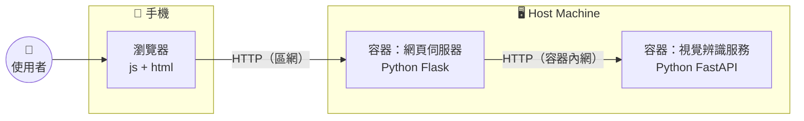

# 這周進度：

實作登錄/辨識物品的使用者介面

# 展示影片：

https://youtube.com/shorts/TkoCwmjfRO8?si=q9hsQd74ISbknbzb

# 架構：

# 工作紀錄：

| 日期 | 姓名 | 內容 |
|---|---|---|
| 2026/9/11 | 王淯霆 | 建立網頁伺服器，跟資料庫和視覺辨識服務通訊，提供前端使用者：網頁介面跟API服務 |
| 2026/9/12 | 王淯霆 | 新增"庫存列表"頁面，可以列出當前登記的物品，和他們的庫存狀況 |
| 2026/9/12 | 王淯霆 | 新增"登記物品"頁面，可以拍照掃描，登記新物品 |
| 2026/9/12 | 王淯霆 | 新增"辨識物品"頁面，可以拍照掃描，辨識出已登記的物品 |

## repo連結：

| 專案 | 連結 |
|---|---|
| 庫存管理系統 | https://github.com/shellkz/inventory-management-system |
| 視覺辨識服務 | https://github.com/shellkz/sharingan-vision |
| 工作紀錄 | https://docs.google.com/spreadsheets/d/14lhbw2W-QW1XC43eWqU5UbMBi4qz3phjSWs2ngRkvmg/edit?usp=sharing |
